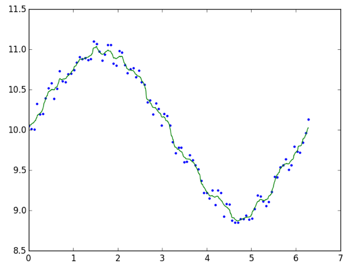

# ExtremelyRandomizedTrees

[](https://travis-ci.org/rened/ExtremelyRandomizedTrees.jl)

This package provides an implementation of Extremely Randomized Trees by Geurts et al 2006. Similar to Random Forests, ExtraTrees construct trees by splitting the input space semi-randomly and accumulating the target values associated with the input data found in the 'leafs' of this splitting procedure.

ExtraTrees can be used in classification and regression settings. Extending the original algorithm, this package also provides support for regression with multi-dimensional target values.


## Classification

```jl
using ExtremelyRandomizedTrees, MNIST

trainX, trainY = traindata()
testX, testY = testdata()

model = ExtraTrees(trainX,trainY'+1)  # labels need to be >=1
result = predict(model, testX)

accuracy = 100*sum(result.==testY'+1)/length(testY)   # => 97.05 %
```

## Regression

```jl
using ExtremelyRandomizedTrees, PyPlot

trainingData = linspace(0,2*pi,100)'
testData = linspace(0,2*pi,1000)'
trainingLabels = 10 + sin(trainingData) + (0.3*rand(size(trainingData))-0.15);

model = ExtraTrees(trainingData, trainingLabels; regression = true)
result = predict(model, testData)

plot(trainingData, trainingLabels,"b.", hold = true);
plot(testData', result',"g-", hold = true);
```



## Parameters

The constructor takes two parameters and optimal keyword arguments:
```jl
ExtraTrees(data, labels; kargs...)
```
with the requirement that `size(data,2) == size(labels,2)`.

The optional arguments with their defaults are:
* `regression = false`: Regression if `true`, classification otherwise
* `ntrees = 32`: Number of trees
* `classificationNMin = 2` and `regressionNMin = 5`: Higher values can be used for regularization (see the paper for details)
* `nclasses = int(maximum(labels))`: In case that `labels` might not contain examples for every class, the number of classes can be set explicitly
* `k = round(sqrt(size(data,1)))`: Number of features investigated for splits at every node (see the paper for details)

ExtraTrees are quite robust regarding these parameter settings, so there is rarely any need to meta-optimize them.

Prediction is performed with `predict`:

```jl
result = predict(a,testData)
```

or 

```jl
result, votes = predict(a, testData, returnvotes = true)
```

## News

#### 0.0.7

* Fixed severe bugs in classification and regression
* Considerably improved performance of both training and prediction
